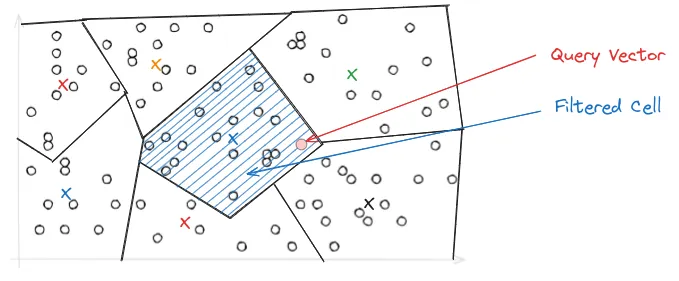

# Vector Indexing in LanceDB

## Understanding IVF-PQ Index

An ANN (Approximate Nearest Neighbors) index is a data structure that represents data in a way that makes it more efficient to search and retrieve. Using an ANN index is faster, but less accurate than kNN or brute force search because, in essence, the index is a lossy representation of the data.

LanceDB is fundamentally different from other vector databases in that it is built on top of [Lance](https://github.com/lancedb/lance), an open-source columnar data format designed for performant ML workloads and fast random access. Due to the design of Lance, LanceDB's indexing philosophy adopts a primarily *disk-based* indexing philosophy.

## IVF-PQ

IVF-PQ is a composite index that combines inverted file index (IVF) and product quantization (PQ). The implementation in LanceDB provides several parameters to fine-tune the index's size, query throughput, latency and recall, which are described later in this section.

### Product Quantization

Quantization is a compression technique used to reduce the dimensionality of an embedding to speed up search.

Product quantization (PQ) works by dividing a large, high-dimensional vector of size into equally sized subvectors. Each subvector is assigned a "reproduction value" that maps to the nearest centroid of points for that subvector. The reproduction values are then assigned to a codebook using unique IDs, which can be used to reconstruct the original vector.

It's important to remember that quantization is a *lossy process*, i.e., the reconstructed vector is not identical to the original vector. This results in a trade-off between the size of the index and the accuracy of the search results.

As an example, consider starting with 128-dimensional vector consisting of 32-bit floats. Quantizing it to an 8-bit integer vector with 4 dimensions as in the image above, we can significantly reduce memory requirements.

!!! example "Effect of quantization"

    Original: `128 × 32 = 4096` bits
    Quantized: `4 × 8 = 32` bits

    Quantization results in a **128x** reduction in memory requirements for each vector in the index, which is substantial.

### Inverted File Index (IVF) Implementation

While PQ helps with reducing the size of the index, IVF primarily addresses search performance. The primary purpose of an inverted file index is to facilitate rapid and effective nearest neighbor search by narrowing down the search space.

In IVF, the PQ vector space is divided into *Voronoi cells*, which are essentially partitions that consist of all the points in the space that are within a threshold distance of the given region's seed point. These seed points are initialized by running K-means over the stored vectors. The centroids of K-means turn into the seed points which then each define a region. These regions are then are used to create an inverted index that correlates each centroid with a list of vectors in the space, allowing a search to be restricted to just a subset of vectors in the index.

During query time, depending on where the query lands in vector space, it may be close to the border of multiple Voronoi cells, which could make the top-k results ambiguous and span across multiple cells. To address this, the IVF-PQ introduces the `nprobe` parameter, which controls the number of Voronoi cells to search during a query. The higher the `nprobe`, the more accurate the results, but the slower the query.

## HNSW Index Implementation

Approximate Nearest Neighbor (ANN) search is a method for finding data points near a given point in a dataset, though not always the exact nearest one. HNSW is one of the most accurate and fastest Approximate Nearest Neighbour search algorithms, It's beneficial in high-dimensional spaces where finding the same nearest neighbor would be too slow and costly.

### Types of ANN Search Algorithms

Approximate Nearest Neighbor (ANN) search is a method for finding data points near a given point in a dataset, though not always the exact nearest one. HNSW is one of the most accurate and fastest Approximate Nearest Neighbour search algorithms, It's beneficial in high-dimensional spaces where finding the same nearest neighbor would be too slow and costly

There are three main types of ANN search algorithms:

* **Tree-based search algorithms**: Use a tree structure to organize and store data points.
* **Hash-based search algorithms**: Use a specialized geometric hash table to store and manage data points. These algorithms typically focus on theoretical guarantees, and don't usually perform as well as the other approaches in practice.
* **Graph-based search algorithms**: Use a graph structure to store data points, which can be a bit complex. 

HNSW is a graph-based algorithm. All graph-based search algorithms rely on the idea of a k-nearest neighbor (or k-approximate nearest neighbor) graph, which we outline below.  
HNSW also combines this with the ideas behind a classic 1-dimensional search data structure: the skip list.

### Understanding k-Nearest Neighbor Graphs

The k-nearest neighbor graph actually predates its use for ANN search. Its construction is quite simple:

* Each vector in the dataset is given an associated vertex.
* Each vertex has outgoing edges to its k nearest neighbors. That is, the k closest other vertices by Euclidean distance between the two corresponding vectors. This can be thought of as a "friend list" for the vertex.
* For some applications (including nearest-neighbor search), the incoming edges are also added.

Eventually, it was realized that the following greedy search method over such a graph typically results in good approximate nearest neighbors:

* Given a query vector, start at some fixed "entry point" vertex (e.g. the approximate center node).
* Look at that vertex's neighbors. If any of them are closer to the query vector than the current vertex, then move to that vertex.
* Repeat until a local optimum is found.

The above algorithm also generalizes to e.g. top 10 approximate nearest neighbors.

Computing a k-nearest neighbor graph is actually quite slow, taking quadratic time in the dataset size. It was quickly realized that near-identical performance can be achieved using a k-approximate nearest neighbor graph. That is, instead of obtaining the k-nearest neighbors for each vertex, an approximate nearest neighbor search data structure is used to build much faster.  
In fact, another data structure is not needed: This can be done "incrementally".
That is, if you start with a k-ANN graph for n-1 vertices, you can extend it to a k-ANN graph for n vertices as well by using the graph to obtain the k-ANN for the new vertex.

One downside of k-NN and k-ANN graphs alone is that one must typically build them with a large value of k to get decent results, resulting in a large index.

### Hierarchical Navigable Small Worlds (HNSW)

HNSW builds on k-ANN in two main ways:

* Instead of getting the k-approximate nearest neighbors for a large value of k, it sparsifies the k-ANN graph using a carefully chosen "edge pruning" heuristic, allowing for the number of edges per vertex to be limited to a relatively small constant.
* The "entry point" vertex is chosen dynamically using a recursively constructed data structure on a subset of the data, similarly to a skip list.

This recursive structure can be thought of as separating into layers:

* At the bottom-most layer, an k-ANN graph on the whole dataset is present.
* At the second layer, a k-ANN graph on a fraction of the dataset (e.g. 10%) is present.
* At the Lth layer, a k-ANN graph is present. It is over a (constant) fraction (e.g. 10%) of the vectors/vertices present in the L-1th layer.

Then the greedy search routine operates as follows:

* At the top layer (using an arbitrary vertex as an entry point), use the greedy local search routine on the k-ANN graph to get an approximate nearest neighbor at that layer.
* Using the approximate nearest neighbor found in the previous layer as an entry point, find an approximate nearest neighbor in the next layer with the same method.
* Repeat until the bottom-most layer is reached. Then use the entry point to find multiple nearest neighbors (e.g. top 10).

## Index Management and Maintenance

Embeddings for a given dataset are made searchable via an **index**. The index is constructed by using data structures that store the embeddings such that it's very efficient to perform scans and lookups on them. A key distinguishing feature of LanceDB is it uses a disk-based index: IVF-PQ, which is a variant of the Inverted File Index (IVF) that uses Product Quantization (PQ) to compress the embeddings.

## Reindexing and Incremental Indexing

Reindexing is the process of updating the index to account for new data, keeping good performance for queries. This applies to either a full-text search (FTS) index or a vector index. For ANN search, new data will always be included in query results, but queries on tables with unindexed data will fallback to slower search methods for the new parts of the table. This is another important operation to run periodically as your data grows, as it also improves performance. This is especially important if you're appending large amounts of data to an existing dataset.

!!! tip
    When adding new data to a dataset that has an existing index (either FTS or vector), LanceDB doesn't immediately update the index until a reindex operation is complete.

> Both LanceDB OSS and Cloud support reindexing, but the process (at least for now) is different for each, depending on the type of index.

When a reindex job is triggered in the background, the entire data is reindexed, but in the interim as new queries come in, LanceDB will combine results from the existing index with exhaustive kNN search on the new data. This is done to ensure that you're still searching on all your data, but it does come at a performance cost. The more data that you add without reindexing, the impact on latency (due to exhaustive search) can be noticeable.

