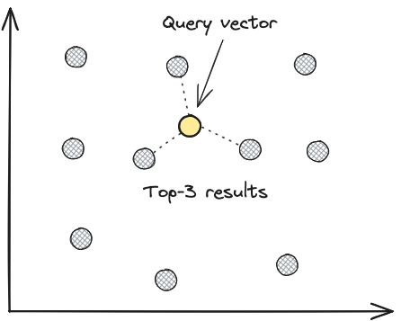

# **Vector Search in LanceDB**

## Understanding Vector Search Fundamentals

Vector search is a technique used to search for similar items based on their vector representations, called embeddings. It is also known as similarity search, nearest neighbor search, or approximate nearest neighbor search.

Raw data (e.g. text, images, audio, etc.) is converted into embeddings via an embedding model, which are then stored in a vector database like LanceDB. To perform similarity search at scale, an index is created on the stored embeddings, which can then used to perform fast lookups.

## Brute Force Search Implementation

The simplest way to perform vector search is to perform a brute force search, without an index, where the distance between the query vector and all the vectors in the database are computed, with the top-k closest vectors returned. This is equivalent to a k-nearest neighbours (kNN) search in vector space.

As you can imagine, the brute force approach is not scalable for datasets larger than a few hundred thousand vectors, as the latency of the search grows linearly with the size of the dataset. This is where approximate nearest neighbour (ANN) algorithms come in.

## Approximate Nearest Neighbor (ANN) Search

Instead of performing an exhaustive search on the entire database for each and every query, approximate nearest neighbour (ANN) algorithms use an index to narrow down the search space, which significantly reduces query latency. The trade-off is that the results are not guaranteed to be the true nearest neighbors of the query, but are usually "good enough" for most use cases.

