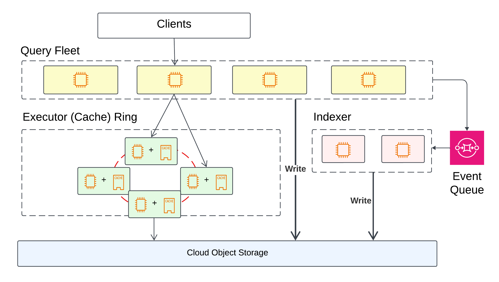

# LanceDB Enterprise Architecture

LanceDB Enterprise has the following key components

- Query fleet
- Plan execution fleet
- Indexer fleet

### Query Execution

The LanceDB stateless query fleet is capable of managing **tens of thousands** of queries per second (QPS) per table with minimal latency.
This level of throughput satisfies the requirements of even the most demanding production environments.

Each query is compiled into a distributed query plan, and being executed on the Plan Execution Fleet in parallel.
Additionally, each query is auto-vectorized for recent generations of `X86_64` and `ARM`
CPUs for enhanced hardware efficiency.

### Plan Execution Fleet

Each plan execution node is equipped with high-performance NVMe SSDs that act as
a hybrid cache for cloud object storage systems like AWS S3,
Google GCS, and Azure Blob Storage.

The distributed query plan enforces cache locality for both data and indices using a variant of
**Consistent Hashing** algorithm with low cache miss rate.
LanceDB can serve warm queries with latency in **the single-digit to low double-digit milliseconds** range.

### Write Path

LanceDB Enterprise is engineered for high-throughput data ingestion and indexing.
The system ensures data persistence on durable object storage before confirming any write request.

An extensive indexing fleet, enhanced with hardware acceleration, operates asynchronously to
perform partial or full indexing, data compaction, and cleanup.
Furthermore, we achieve high-throughput indexing operations without compromising query performance.

<Tip>
  Customer data does not go through the event queue. The queue sends events such
  as create an index to the indexers to trigger actions.
</Tip>

Note: Indexing scales down to zero when there is no activity on the table.
