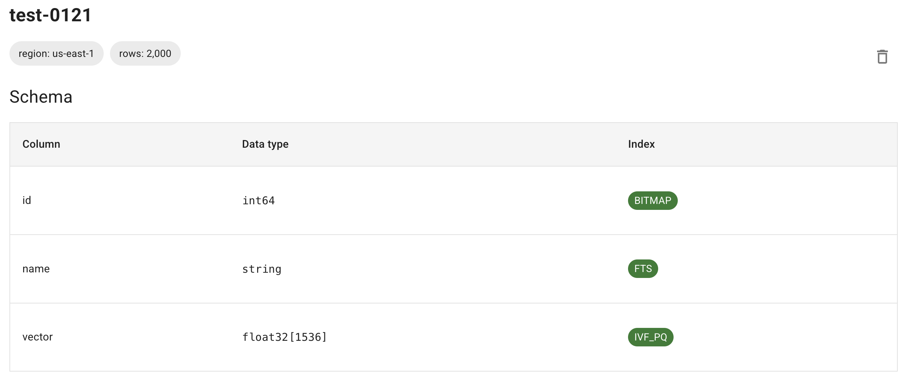

# Building an Index with LanceDB

LanceDB provides a comprehensive suite of indexing strategies to optimize query performance across diverse workloads:

- **Vector Index**: Optimized for searching high-dimensional data (like images, audio, or text embeddings) by efficiently finding the most similar vectors
- **Scalar Index**: Accelerates filtering and sorting of structured numeric or categorical data (e.g., timestamps, prices)
- **Full-Text Search Index**: Enables fast keyword-based searches by indexing words and phrases


Scalar indices serve as a foundational optimization layer, accelerating filtering across diverse search workloads. They can be combined with:

Vector search (prefilter or post-filter results using metadata)
- Full-text search (combining keyword matching with structured filters)
- SQL scans (optimizing WHERE clauses on scalar columns)
- Key-value lookups (enabling rapid primary key-based retrievals)


Compared to our open source version, LanceDB Cloud/Enterprise automates data indexing with low-latency, asynchronous indexing performed in the cloud.
- **Auto-Indexing**: Automates index optimization for all types of indices as soon as data is updated
- **Automatic Index Creation**: When a table contains a single vector column named `vector`, LanceDB:
  - Infers the vector column from the table schema
  - Creates an optimized IVF-PQ index without manual configuration
- **Parameter Autotuning**: LanceDB analyzes your data distribution to automatically configure indexing parameters

## Vector Index

LanceDB implements state-of-the-art indexing algorithms ([IVF-PQ](https://lancedb.github.io/lancedb/concepts/index_ivfpq/) and [HNSW](https://lancedb.github.io/lancedb/concepts/index_hnsw/)) with acceleration from our optimized infrastructure. We support multiple distance metrics:

- L2 (default)
- Cosine
- Dot
- Hamming (for binary vectors only)

You can create multiple vector indices within a table.

> The `create_index` API returns immediately, but the building of the vector index is asynchronous. To wait until all data is fully indexed, you can specify the`wait_timeout`parameter.


=== "Python"
    ```python
    import lancedb
    from datetime import timedelta

    # Connect to LanceDB
    db = lancedb.connect(
      uri="db://your-project-slug",
      api_key="your-api-key",
      region="us-east-1"
    )

    # Use the table from quickstart
    table_name = "lancedb-cloud-quickstart"
    table = db.open_table(table_name)

    # Create index with cosine similarity
    # Note: vector_column_name only needed for multiple vector columns or non-default names
    # Supported index types: IVF_PQ (default) and IVF_HNSW_SQ
    table.create_index(metric="cosine", vector_column_name="keywords_embeddings", wait_timeout=timedelta(seconds=60))
    ```

=== "TypeScript"
    ```typescript
    import * as lancedb from "@lancedb/lancedb"

    const db = await lancedb.connect({
      uri: "db://your-project-slug",
      apiKey: "your-api-key",
      region: "us-east-1"
    });

    const tableName = "myTable"
    const table = await db.openTable(tableName);

    // Create index with cosine similarity
    // Note: vector_column_name only needed for multiple vector columns or non-default names
    // Supported index types: IVF_PQ (default) and IVF_HNSW_SQ
    await table.createIndex("keywords_embeddings", {
      config: lancedb.Index.ivfPq({
        distanceType: 'cosine'
      })
    });
    ```


- If your vector column is named `vector` and contains more than 256 vectors, an IVF_PQ index with L2 distance is automatically created
- You can create a new index with different parameters using `create_index` - this replaces any existing index
- When using cosine similarity, distances range from 0 (identical vectors) to 2 (maximally dissimilar)
- Available index types:
- `IVF_PQ`: Default index type, optimized for high-dimensional vectors
- `IVF_HNSW_SQ`: Combines IVF clustering with HNSW graph for improved search quality


### Check Index Status

Vector index creation is fast - typically a few minutes for 1 million vectors with 1536 dimensions. You can check index status in two ways:

#### Option 1: Dashboard

Navigate to your table page - the "Index" column shows index status. It remains blank if no index exists or if creation is in progress.


#### Option 2: API

Use `list_indices()` and `index_stats()` to check index status. The index name is formed by appending "\_idx" to the column name. Note that `list_indices()` only returns information after the index is fully built.
To wait until all data is fully indexed, you can specify the `wait_timeout` parameter on `create_index()` or call `wait_for_index()` on the table.

=== "Python"
    ```python
    import time

    index_name = "keywords_embeddings_idx"
    table.wait_for_index([index_name])
    print(table.index_stats(index_name))
    # IndexStatistics(num_indexed_rows=3000, num_unindexed_rows=0, index_type='IVF_PQ', 
    #   distance_type='cosine', num_indices=None)
    ```

=== "TypeScript"
    ```typescript
    const indexName = "keywords_embeddings_idx"
    await table.waitForIndex([indexName], 60)
    console.log(await table.indexStats(indexName))
    // {
    //   numIndexedRows: 1000,
    //   numUnindexedRows: 0,
    //   indexType: 'IVF_PQ',
    //   distanceType: 'cosine'
    // }
    ```

### Index Binary Vectors

Binary vectors are useful for hash-based retrieval, fingerprinting, or any scenario where data can be represented as bits.

Key points for binary vectors:

- Store as fixed-size binary data (uint8 arrays, with 8 bits per byte)
- Use Hamming distance for similarity search
- Pack binary vectors into bytes to save space

<Info>
  The dimension of binary vectors must be a multiple of 8. For example, a 128-dimensional vector is stored as a uint8 array of size 16.
</Info>

=== "Python"
    ```python
    import lancedb
    import numpy as np
    import pyarrow as pa

    # Connect to LanceDB
    db = lancedb.connect(
      uri="db://your-project-slug",
      api_key="your-api-key",
      region="us-east-1"
    )

    # Create schema with binary vector field
    table_name = "test-hamming"
    ndim = 256
    schema = pa.schema([
        pa.field("id", pa.int64()),
        # For dim=256, store every 8 bits in a byte (32 bytes total)
        pa.field("vector", pa.list_(pa.uint8(), 32)),
    ])

    table = db.create_table(table_name, schema=schema, mode="overwrite")

    # Generate and add data
    data = []
    for i in range(1024):
        vector = np.random.randint(0, 2, size=ndim)
        vector = np.packbits(vector)  # Optional: pack bits to save space
        data.append({"id": i, "vector": vector})
    table.add(data)

    # Create index with Hamming distance
    table.create_index(
        metric="hamming",
        vector_column_name="vector",
        index_type="IVF_FLAT"
    )

    # Search example
    query = np.random.randint(0, 2, size=256)
    query = np.packbits(query)
    df = table.search(query).metric("hamming").limit(10).to_pandas()
    df.vector = df.vector.apply(np.unpackbits)
    ```

=== "TypeScript"
    ```typescript
    // Create schema with binary vector field
    const binaryTableName = "test-hamming-ts";
    const ndim = 256;
    const bytesPerVector = ndim / 8; // 32 bytes for 256 bits

    const binarySchema = new Schema([
      new Field("id", new Int32(), true),
      new Field("vector", new FixedSizeList(32, new Field("item", new Uint8()))),
    ]);

    // Generate random binary vectors
    const data = makeArrowTable(
      Array(1_000).fill(0).map((_, i) => ({
        id: i,
        vector: packBits(Array(ndim).fill(0).map(() => Math.floor(Math.random() * 2))),
      })),
      { schema: binarySchema },
    );

    // Create and populate table
    const table = await db.createTable(binaryTableName, data);
    console.log(`Created table: ${binaryTableName}`);

    // Create index with Hamming distance
    console.log("Creating binary vector index...");
    await table.createIndex("vector", {
      config: Index.ivfFlat({
        distanceType: "hamming",
      }),
    });

    // Wait for index
    const binaryIndexName = "vector_idx";
    await table.waitForIndex([binaryIndexName], 60)

    // Generate query and search
    const query = packBits(Array(ndim).fill(0).map(() => Math.floor(Math.random() * 2)));
    console.log("Performing binary vector search...");
    const binaryResults = await table
      .query()
      .nearestTo(query)
      .limit(10)
      .toArray();

    // Unpack vectors for display
    const unpackedResults = binaryResults.map(row => ({
      ...row,
      vector: Array.from(row.vector)
    }));
    console.log("Binary vector search results:", unpackedResults);
    ```


> `IVF_FLAT` with Hamming distance is used for indexing binary vectors.

## Scalar Index

LanceDB Cloud and Enterprise support several types of scalar indices to accelerate search over scalar columns:

- **BTREE**: The most common type, inspired by the btree data structure. Performs well for columns with many unique values and few rows per value.
- **BITMAP**: Stores a bitmap for each unique value. Ideal for columns with a finite number of unique values and many rows per value (e.g., categories, labels, tags).
- **LABEL_LIST**: Special index for `List<T>` columns, supporting `array_contains_all` and `array_contains_any` queries using an underlying bitmap index.

You can create multiple scalar indices within a table.

> The `create_scalar_index` API returns immediately, but the building of the scalar index is asynchronous.

=== "Python"
    ```python
    import lancedb

    # Connect to LanceDB
    db = lancedb.connect(
      uri="db://your-project-slug",
      api_key="your-api-key",
      region="us-east-1"
    )

    table_name = "lancedb-cloud-quickstart"
    table = db.open_table(table_name)
    # Create BITMAP index (default is BTREE)
    table.create_scalar_index("label", index_type="BITMAP")
    ```

=== "TypeScript"
    ```typescript
    import * as lancedb from "@lancedb/lancedb"

    const db = await lancedb.connect({
      uri: "db://your-project-slug",
      apiKey: "your-api-key",
      region: "us-east-1"
    });

    const tableName = "lancedb-cloud-quickstart"
    const table = await db.openTable(tableName);
    await table.createIndex("label", {
      config: lancedb.Index.bitmap()
    });
    ```

Check scalar index status using the [methods above](#check-index-status).

=== "Python"
    ```python
    index_name = "label_idx"
    table.wait_for_index([index_name])
    ```

=== "TypeScript"
    ```typescript
    const indexName = "label_idx"
    await table.waitForIndex([indexName], 60)
    ```

### Build a Scalar Index on UUID Columns

LanceDB supports scalar indices on UUID columns (stored as `FixedSizeBinary(16)`), enabling efficient lookups and filtering on UUID-based primary keys.

To use FixedSizeBinary, ensure you have:
- Python SDK version [0.22.0-beta.4](https://github.com/lancedb/lancedb/releases/tag/python-v0.22.0-beta.4) or later
- TypeScript SDK version [0.19.0-beta.4](https://github.com/lancedb/lancedb/releases/tag/v0.19.0-beta.4) or later

=== "Python [expandable]"
    ```python
    import lancedb
    import uuid
    import pyarrow as pa

    class UuidType(pa.ExtensionType):
        def __init__(self):
            super().__init__(pa.binary(16), "my.uuid")

        def __arrow_ext_serialize__(self):
            return b'uuid-metadata'

        @classmethod
        def __arrow_ext_deserialize__(cls, storage_type, serialized):
            return UuidType()

    pa.register_extension_type(UuidType())

    def generate_random_string(length=10):
        return ''.join(random.choices(string.ascii_letters + string.digits, k=length))

    def generate_uuids(num_items):
        return [uuid.uuid4().bytes for _ in range(num_items)]

    # Connect to LanceDB
    db = lancedb.connect(
      uri="db://your-project-slug",
      api_key="your-api-key",
      region="us-east-1"
    )

    n = 100
    uuids = generate_uuids(n)
    names = [generate_random_string() for _ in range(n)]

    # Create arrays
    uuid_array = pa.array(uuids, pa.binary(16))
    name_array = pa.array(names, pa.string())
    extension_array = pa.ExtensionArray.from_storage(UuidType(), uuid_array)

    # Create schema
    schema = pa.schema([
        pa.field('id', UuidType()),
        pa.field('name', pa.string())
    ])

    # Create table
    data_table = pa.Table.from_arrays([extension_array, name_array], schema=schema)
    table_name = "index-on-uuid-test"
    table = db.create_table(table_name, data=data_table, mode="overwrite")

    # Create index
    table.create_scalar_index("id")
    index_name = "id_idx"
    wait_for_index(table, index_name)

    # Upsert example
    new_users = [
        {"id": uuid.uuid4().bytes, "name": "Bobby"},
        {"id": uuid.uuid4().bytes, "name": "Charlie"},
    ]

    table.merge_insert("id") \
        .when_matched_update_all() \
        .when_not_matched_insert_all() \
        .execute(new_users)
    ```

=== "TypeScript [expandable]"
    ```typescript
    import * as lancedb from "@lancedb/lancedb"
    import { v4 as uuidv4 } from "uuid"
    import { Schema, Field, FixedSizeBinary, Utf8 } from "apache-arrow"

    export function uuidToBuffer(uuid: string): Buffer {
      return Buffer.from(uuid.replace(/-/g, ''), 'hex');
    }

    export function generateUuids(numItems: number): Buffer[] {
      return Array.from({ length: numItems }, () => uuidToBuffer(uuidv4()));
    }

    export function generateRandomString(length: number = 10): string {
      const chars = 'ABCDEFGHIJKLMNOPQRSTUVWXYZabcdefghijklmnopqrstuvwxyz0123456789';
      return Array.from(
          { length },
          () => chars.charAt(Math.floor(Math.random() * chars.length))
      ).join('');
    }

    // Connect to LanceDB
    const db = await lancedb.connect({
      uri: "db://your-project-slug",
      apiKey: "your-api-key",
      region: "us-east-1"
    });

    const tableName = "index-on-uuid-test-ts";
    const n = 100;
    const uuids = generateUuids(n);
    const names = Array.from({ length: n }, () => generateRandomString());

    // Create schema
    const schema = new Schema([
      new Field("id", new FixedSizeBinary(16), true),
      new Field("name", new Utf8(), false),
    ]);

    // Create data array
    const data = makeArrowTable(
      uuids.map((id, index) => ({
        id,
        name: names[index],
      })),
      { schema }
    );

    // Create table
    const table = await db.createTable(tableName, data, { mode: "overwrite" });
    console.log(`Created table: ${tableName}`);

    // Create scalar index
    console.log("Creating scalar index on 'id' column...");
    await table.createIndex("id", {
      config: Index.bitmap(),
    });

    // Wait for index
    const scalarIndexName = "id_idx";
    await waitForIndex(table, scalarIndexName);

    // Upsert example
    const newUsers = [
      { id: uuidToBuffer(uuidv4()), name: "Bobby" },
      { id: uuidToBuffer(uuidv4()), name: "Charlie" },
    ];

    console.log("Performing upsert operation...");
    await table.mergeInsert("id")
      .whenMatchedUpdateAll()
      .whenNotMatchedInsertAll()
      .execute(newUsers);
    ```

## Full-Text Search Index

LanceDB Cloud and Enterprise provide performant full-text search based on BM25, allowing you to incorporate keyword-based search in your retrieval solutions.

> The `create_fts_index` API returns immediately, but the building of the FTS index is asynchronous.

=== "Python"
    ```python
    import lancedb

    # Connect to LanceDB
    db = lancedb.connect(
      uri="db://your-project-slug",
      api_key="your-api-key",
      region="us-east-1"
    )

    table_name = "lancedb-cloud-quickstart"
    table = db.open_table(table_name)
    table.create_fts_index("text")
    ```

=== "TypeScript"
    ```typescript
    import * as lancedb from "@lancedb/lancedb"

    const db = await lancedb.connect({
      uri: "db://your-project-slug",
      apiKey: "your-api-key",
      region: "us-east-1"
    });

    const tableName = "lancedb-cloud-quickstart"
    const table = openTable(tableName);
    await table.createIndex("text", {
      config: lancedb.Index.fts()
    });
    ```

Check FTS index status using the [methods above](#check-index-status).

=== "Python"
    ```python
    index_name = "text_idx"
    table.wait_for_index([index_name])
    ```

=== "TypeScript"
    ```typescript
    const indexName = "text_idx"
    await table.waitForIndex([indexName], 60)
    ```

### FTS Configuration Parameters

LanceDB supports the following configurable parameters for full-text search:

| Parameter         | Type | Default   | Description                                                                                                                                   |
| ----------------- | ---- | --------- | --------------------------------------------------------------------------------------------------------------------------------------------- |
| with_position     | bool | True      | Store token positions (required for phrase queries)                                                                                           |
| base_tokenizer    | str  | "simple"  | Text splitting method:  - "simple": Split by whitespace/punctuation  - "whitespace": Split by whitespace only  - "raw": Treat as single token |
| language          | str  | "English" | Language for tokenization (stemming/stop words)                                                                                               |
| max_token_length  | int  | 40        | Maximum token size in bytes; tokens exceeding this length are omitted from the index                                                          |
| lower_case        | bool | True      | Convert tokens to lowercase                                                                                                                   |
| stem              | bool | False     | Apply stemming (e.g., "running" → "run")                                                                                                      |
| remove_stop_words | bool | False     | Remove common stop words                                                                                                                      |
| ascii_folding     | bool | False     | Normalize accented characters                                                                                                                 |

- The `max_token_length` parameter helps optimize indexing performance by filtering out non-linguistic content like base64 data and long URLs
- When `with_position` is disabled, phrase queries will not work, but index size is reduced and indexing is faster
- `ascii_folding` is useful for handling international text (e.g., "café" → "cafe")

### Full-Text Search on Array Fields

LanceDB supports full-text search on string array columns, enabling efficient keyword-based search across multiple values within a single field (e.g., tags, keywords).

=== "Python"
    ```python
    import lancedb

    # Connect to LanceDB
    db = lancedb.connect(
      uri="db://your-project-slug",
      api_key="your-api-key",
      region="us-east-1"
    )

    table_name = "fts-array-field-test"
    schema = pa.schema([
        pa.field("id", pa.string()),
        pa.field("tags", pa.list_(pa.string())),
        pa.field("description", pa.string())
    ])

    # Generate sample data
    data = {
        "id": [f"doc_{i}" for i in range(10)],
        "tags": [
            ["python", "machine learning", "data science"],
            ["deep learning", "neural networks", "AI"],
            ["database", "indexing", "search"],
            ["vector search", "embeddings", "AI"],
            ["full text search", "indexing", "database"],
            ["python", "web development", "flask"],
            ["machine learning", "deep learning", "pytorch"],
            ["database", "SQL", "postgresql"],
            ["search engine", "elasticsearch", "indexing"],
            ["AI", "transformers", "NLP"]
        ],
        "description": [
            "Python for data science projects",
            "Deep learning fundamentals",
            "Database indexing techniques",
            "Vector search implementations",
            "Full-text search guide",
            "Web development with Python",
            "Machine learning with PyTorch",
            "Database management systems",
            "Search engine optimization",
            "AI and NLP applications"
        ]
    }

    # Create table and add data
    table = db.create_table(table_name, schema=schema, mode="overwrite")
    table_data = pa.Table.from_pydict(data, schema=schema)
    table.add(table_data)

    # Create FTS index
    table.create_fts_index("tags")
    wait_for_index(table, "tags_idx")

    # Search examples
    print("\nSearching for 'learning' in tags with a typo:")
    result = table.search(MatchQuery("learnin", column="tags", fuzziness=1), query_type="fts").select(['id', 'tags', 'description']).to_arrow()

    print("\nSearching for 'machine learning' in tags:")
    result = table.search(PhraseQuery("machine learning", column="tags"), query_type="fts").select(['id', 'tags', 'description']).to_arrow()
    ```

=== "TypeScript"
    ```typescript
    import * as lancedb from "@lancedb/lancedb"

    const db = await lancedb.connect({
      uri: "db://your-project-slug",
      apiKey: "your-api-key",
      region: "us-east-1"
    });

    const tableName = "fts-array-field-test-ts";

    // Create schema
    const schema = new Schema([
      new Field("id", new Utf8(), false),
      new Field("tags", new List(new Field("item", new Utf8()))),
      new Field("description", new Utf8(), false)
    ]);

    // Generate sample data
    const data = makeArrowTable(
      Array(10).fill(0).map((_, i) => ({
        id: `doc_${i}`,
        tags: [
          ["python", "machine learning", "data science"],
          ["deep learning", "neural networks", "AI"],
          ["database", "indexing", "search"],
          ["vector search", "embeddings", "AI"],
          ["full text search", "indexing", "database"],
          ["python", "web development", "flask"],
          ["machine learning", "deep learning", "pytorch"],
          ["database", "SQL", "postgresql"],
          ["search engine", "elasticsearch", "indexing"],
          ["AI", "transformers", "NLP"]
        ][i],
        description: [
          "Python for data science projects",
          "Deep learning fundamentals",
          "Database indexing techniques",
          "Vector search implementations",
          "Full-text search guide",
          "Web development with Python",
          "Machine learning with PyTorch",
          "Database management systems",
          "Search engine optimization",
          "AI and NLP applications"
        ][i]
      })),
      { schema }
    );

    // Create table
    const table = await db.createTable(tableName, data, { mode: "overwrite" });
    console.log(`Created table: ${tableName}`);

    // Create FTS index
    console.log("Creating FTS index on 'tags' column...");
    await table.createIndex("tags", {
      config: Index.fts()
    });

    // Wait for index
    const ftsIndexName = "tags_idx";
    await waitForIndex(table, ftsIndexName);

    // Search examples
    console.log("\nSearching for 'learning' in tags with a typo:");
    const fuzzyResults = await table.query()
      .fullTextSearch(new MatchQuery("learnin", "tags", {
        fuzziness: 2,
      }))
      .select(["id", "tags", "description"])
      .toArray();
    console.log(fuzzyResults);

    console.log("\nSearching for 'machine learning' in tags:");
    const phraseResults = await table.query()
      .fullTextSearch(new PhraseQuery("machine learning", "tags"))
      .select(["id", "tags", "description"])
      .toArray();
    console.log(phraseResults);
    ```

## Update an Index

When new data is added to a table, LanceDB Cloud automatically updates indices in the background.

To check index status, use `index_stats()` to view the number of unindexed rows. This will be zero when indices are fully up-to-date.

While indices are being updated, queries use brute force methods for unindexed rows, which may temporarily increase latency. To avoid this, set `fast_search=True` to search only indexed data.

## GPU-based Indexing

> This feature is currently only available in LanceDB Enterprise. Please [contact us](mailto:contact@lancedb.com) to enable GPU indexing for your deployment.

With GPU-powered indexing, LanceDB can create vector indices with billions of rows in a few hours.