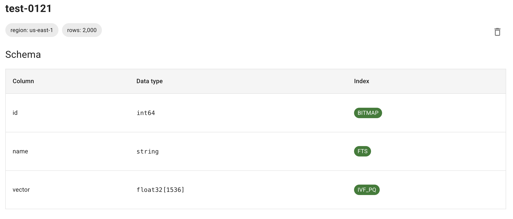

# **Vector Indexes in LanceDB**

LanceDB offers two main vector indexing algorithms: **Inverted File (IVF) Index** and **Hierarchically Navigable Small Worlds (HNSW) Index**. You can create multiple vector indexes within a Lance table. This guide will walk you through some common configurations and build patterns.

### **Option 1: Self-Hosted Indexing**

**Manual, Sync or Async:** If using LanceDB Open Source, you will have to build indexes manually, as well as reindex and tune indexing parameters. The Python SDK lets you do this *sychronously and asychronously*.

### **Option 2: Automated Indexing**

**Automatic and Async:** Indexing is automatic in LanceDB Cloud/Enterprise. As soon as data is updated, our system automates index optimization. *This is done asychronously*.

Here is what happens in the background - when a table contains a single vector column named `vector`, LanceDB automatically:

- Infers the vector column from the table schema
- Creates an optimized `IVF_PQ` index without manual configuration
- The default distance is `l2` or euclidean

Finally, LanceDB Cloud/Enterprise will analyze your data distribution to **automatically configure indexing parameters**.

!!! note "Manual Index Creation"
  You can create a new index with different parameters using `create_index` - this replaces any existing index

  Although the `create_index` API returns immediately, the building of the vector index is asynchronous. To wait until all data is fully indexed, you can specify the `wait_timeout` parameter.

## **Example: Construct IVF Index**

In this example, we will create an index for a table containing 1536-dimensional vectors. The index will use IVF_PQ with L2 distance, which is well-suited for high-dimensional vector search. 

Make sure you have enough data in your table (at least a few thousand rows) for effective index training.

### **Index Configuration**

Sometimes you need to configure the index beyond default parameters:

- Index Types:
    - `IVF_PQ`: Default index type, optimized for high-dimensional vectors
    - `IVF_HNSW_SQ`: Combines IVF clustering with HNSW graph for improved search quality
- `metrix`: default is `l2`, other available are `cosine` or `dot`
    - When using `cosine` similarity, distances range from 0 (identical vectors) to 2 (maximally dissimilar)
- `num_partitions`: The number of partitions in the IVF portion of the index. This number is usually chosen to target a particular number of vectors per partition.
- `num_sub_vectors`: The number of sub-vectors that will be created during Product Quantization (PQ). This number is typically chosen based on the desired recall and the dimensionality of the vector. 

Let's take a look at a sample request for an IVF index:

```python
tbl.create_index(metric="l2", num_partitions=256, num_sub_vectors=96)
```
Please remember - `num_partitions`=256 and `num_sub_vectors`=96 does not work for every dataset. **Those values needs to be adjusted for your particular dataset.**

### **1. Setup**
First, we connect to LanceDB and open the table we want to index.

=== "Python"
    ```python
    import lancedb
    from datetime import timedelta

    # Connect to LanceDB
    db = lancedb.connect(
      uri="db://your-project-slug",
      api_key="your-api-key",
      region="us-east-1"
    )

    # Use the table from quickstart
    table_name = "lancedb-cloud-quickstart"
    table = db.open_table(table_name)
    ```

=== "TypeScript"
    ```typescript
    import * as lancedb from "@lancedb/lancedb"

    const db = await lancedb.connect({
      uri: "db://your-project-slug",
      apiKey: "your-api-key",
      region: "us-east-1"
    });

    const tableName = "myTable"
    const table = await db.openTable(tableName);
    ```

### **2. Construct IVF Index**
Next, create an `IVF_PQ` index with `cosine` similarity. You only need to specify the `vector_column_name` if using multiple vector columns or non-default names.

Product Quantization is the default indexing option. If you want to use Scalar Quantization, switch to `index_type: IVF_SQ`

=== "Python"
    ```python
    table.create_index(metric="cosine", vector_column_name="keywords_embeddings", wait_timeout=timedelta(seconds=60))
    ```

=== "TypeScript"
    ```typescript
    await table.createIndex("keywords_embeddings", {
      config: lancedb.Index.ivfPq({
        distanceType: 'cosine'
      })
    });
    ```
### **3. Query IVF Index**

Search using a random 1536-dimensional embedding:

```python
tbl.search(np.random.random((1536))) \
    .limit(2) \
    .nprobes(20) \
    .refine_factor(10) \
    .to_pandas()
```

### **Search Configuration**

The above query will perform a search on the table `tbl` using the given query vector, with the following parameters:

* `limit`: The number of results to return
* `nprobes`: The number of probes determines the distribution of vector space. While a higher number enhances search accuracy, it also results in slower performance. Typically, setting `nprobes` to cover 5–10% of the dataset proves effective in achieving high recall with minimal latency.
* `refine_factor`: Refine the results by reading extra elements and re-ranking them in memory. A higher number makes the search more accurate but also slower (see the [FAQ](../faq.md#do-i-need-to-set-a-refine-factor-when-using-an-index) page for more details on this).
* `to_pandas()`: Convert the results to a pandas DataFrame


## **Example: Construct HNSW Index**

### **Index Configuration**

There are three key parameters to set when constructing an HNSW index:

- `metric`: The default is `l2` euclidean distance metric. Other available are `dot` and `cosine`.
- `m`: The number of neighbors to select for each vector in the HNSW graph.
- `ef_construction`: The number of candidates to evaluate during the construction of the HNSW graph.

### **1. Construct HNSW Index**

```python
tbl.create_index(index_type="IVF_HNSW_SQ")
```

### **2. Query HNSW Index**
Search using a random 1536-dimensional embedding

```python
tbl.search(np.random.random((1536))) \
    .limit(2) \
    .to_pandas()
```

## **Example: Construct the Binary Vector Index**

Binary vectors are useful for hash-based retrieval, fingerprinting, or any scenario where data can be represented as bits.

### **Index Configuration**

Binary vectors should be stored as fixed-size binary data (uint8 arrays, with 8 bits per byte). For storage, pack binary vectors into bytes to save space. 

- Index Type: `IVF_FLAT` is used for indexing binary vectors
- `metric`: the `hamming` distance is used for similarity search
- The dimension of binary vectors must be a multiple of 8. For example, a 128-dimensional vector is stored as a uint8 array of size 16.

### **1. Create Table and Schema**

First, we create a table with a schema that includes a binary vector field, where each vector is stored as a packed array of bits.

=== "Python"
    ```python
    table_name = "test-hamming"
    ndim = 256
    schema = pa.schema([
        pa.field("id", pa.int64()),
        # For dim=256, store every 8 bits in a byte (32 bytes total)
        pa.field("vector", pa.list_(pa.uint8(), 32)),
    ])

    table = db.create_table(table_name, schema=schema, mode="overwrite")
    ```

=== "TypeScript"
    ```typescript
    const binaryTableName = "test-hamming-ts";
    const ndim = 256;
    const bytesPerVector = ndim / 8; // 32 bytes for 256 bits

    const binarySchema = new Schema([
      new Field("id", new Int32(), true),
      new Field("vector", new FixedSizeList(32, new Field("item", new Uint8()))),
    ]);
    ```

### **2. Generate and Add Data**

Next, we generate random binary vectors and add them to our table, packing the bits to save space.

=== "Python"
    ```python
    data = []
    for i in range(1024):
        vector = np.random.randint(0, 2, size=ndim)
        vector = np.packbits(vector)  # Optional: pack bits to save space
        data.append({"id": i, "vector": vector})
    table.add(data)
    ```

=== "TypeScript"
    ```typescript
    const data = makeArrowTable(
      Array(1_000).fill(0).map((_, i) => ({
        id: i,
        vector: packBits(Array(ndim).fill(0).map(() => Math.floor(Math.random() * 2))),
      })),
      { schema: binarySchema },
    );

    // Create and populate table
    const table = await db.createTable(binaryTableName, data);
    console.log(`Created table: ${binaryTableName}`);
    ```

### **3. Construct Binary Index**

We create an IVF_FLAT index optimized for `hamming` distance calculations on binary vectors.

=== "Python"
    ```python
    table.create_index(
        metric="hamming",
        vector_column_name="vector",
        index_type="IVF_FLAT"
    )
    ```

=== "TypeScript"
    ```typescript
    console.log("Creating binary vector index...");
    await table.createIndex("vector", {
      config: Index.ivfFlat({
        distanceType: "hamming",
      }),
    });

    // Wait for index
    const binaryIndexName = "vector_idx";
    await table.waitForIndex([binaryIndexName], 60)
    ```

### **4. Vector Search**
Finally, we perform a search using a random query vector, finding the nearest neighbors based on Hamming distance.

=== "Python"
    query = np.random.randint(0, 2, size=256)
    query = np.packbits(query)
    df = table.search(query).metric("hamming").limit(10).to_pandas()
    df.vector = df.vector.apply(np.unpackbits)
    ```

=== "TypeScript"
    ```typescript
    const query = packBits(Array(ndim).fill(0).map(() => Math.floor(Math.random() * 2)));
    console.log("Performing binary vector search...");
    const binaryResults = await table
      .query()
      .nearestTo(query)
      .limit(10)
      .toArray();

    // Unpack vectors for display
    const unpackedResults = binaryResults.map(row => ({
      ...row,
      vector: Array.from(row.vector)
    }));
    console.log("Binary vector search results:", unpackedResults);
    ```

## **Check Index Status**

Vector index creation is fast - typically a few minutes for 1 million vectors with 1536 dimensions. You can check index status in two ways:

### **Option 1: Check the UI**

Navigate to your table page - the "Index" column shows index status. It remains blank if no index exists or if creation is in progress.


### **Option 2: Use the API**

Use `list_indices()` and `index_stats()` to check index status. The index name is formed by appending "\_idx" to the column name. Note that `list_indices()` only returns information after the index is fully built.
To wait until all data is fully indexed, you can specify the `wait_timeout` parameter on `create_index()` or call `wait_for_index()` on the table.

=== "Python"
    ```python
    import time

    index_name = "keywords_embeddings_idx"
    table.wait_for_index([index_name])
    print(table.index_stats(index_name))
    # IndexStatistics(num_indexed_rows=3000, num_unindexed_rows=0, index_type='IVF_PQ', 
    #   distance_type='cosine', num_indices=None)
    ```

=== "TypeScript"
    ```typescript
    const indexName = "keywords_embeddings_idx"
    await table.waitForIndex([indexName], 60)
    console.log(await table.indexStats(indexName))
    // {
    //   numIndexedRows: 1000,
    //   numUnindexedRows: 0,
    //   indexType: 'IVF_PQ',
    //   distanceType: 'cosine'
    // }
    ```


