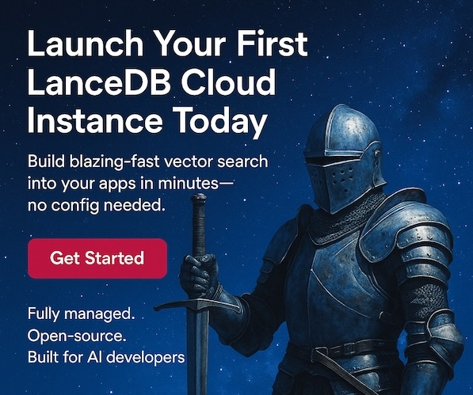

---
hide:
  - toc
---

# LanceDB Documentation Portal

!!! info inline end "How is LanceDB different?"

    Lorem ipsum dolor sit amet, consectetur
    adipiscing elit. Nulla et euismod nulla.
    Curabitur feugiat, tortor non consequat
    finibus, justo purus auctor massa, nec
    semper lorem quam in massa.

[**LanceDB is an open-source vector database**](overview.md) designed for efficient storage, retrieval, and management of vectors and multimodal data. Use our documentation to build a production-grade service with a simple API for inserting, querying, and filtering vectors. 

LanceDB is ideal for **semantic search**, **recommendation systems**, and **Generative AI applications**. 

## **Product Release: Announcing LanceDB Cloud!**

<a href="https://accounts.lancedb.com/sign-up" target="_blank">
{ align=left width="300" }
</a>

1. [**LanceDB Cloud:**](quickstart-cloud.md) Create a LanceDB Cloud cluster that's completely serverless. Your application simply connects over HTTP/HTTPS, and LanceDB handles scaling, storage, and indexing for you. 
2. [**LanceDB OSS:**](basic.md) If self-hosting, embed LanceDB directly into your backend, whether that’s a Django, Flask, FastAPI, or Node.js service. Check out our available [client libraries](api/index.md).
3. [**LanceDB Enterprise:**](enterprise/index.md) Build the best private environment that suits your needs. Manage your own clusters via our [Dashboard UI](https://accounts.lancedb.com/sign-up), but continue to run them within your own private infrastructure for complete security and sovereignty.

## **First-Time Users**

|  |  |  |  |
|-------|-------------|-------|-------------|
| [**Connect to your database**](../guides/storage-setup.md) | Configure local or cloud storage | [**Build a RAG app**](../guides/rag.md) | Create a question-answering system  |
| [**Ingest blob storage data**](../guides/data-ingestion.md) | Load data from S3, GCS, Azure and more | [**Deploy to production**](../guides/deployment.md) | Best practices for production deployment |
| [**Work with Lance tables**](../guides/tables.md) | Create, query and manage tables | [**Optimize performance**](../guides/performance.md) | Tips for maximizing query performance |
| [**Build search queries**](../guides/vector-search.md) | Perform vector search and filtering | [**Monitor & debug**](../guides/monitoring.md) | Monitor your database and fix issues |